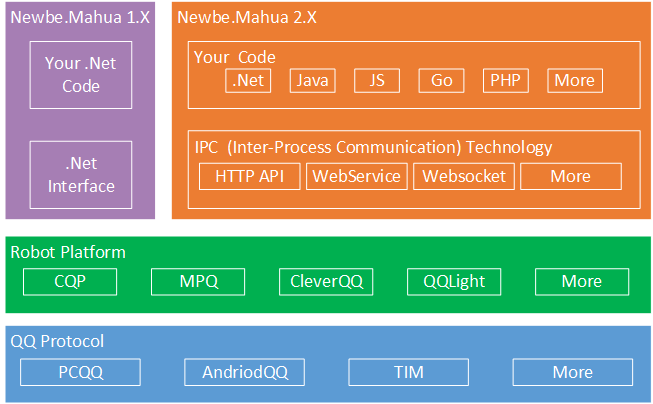

# Newbe.Mahua.Framework

先点击一下右上角的Star，开启隐藏功能。

 

## 开篇一张图，功能全靠编

真正的勇士，看图就明白了其中的道理。

## 你打麻花，谁疼？麻花疼。

QQ协议实现也有不少，QQ机器人平台有不少，这些平台大多具有不同的接口，对接开发存在巨大困难。

使用该SDK开发可以实现一次开发，运行于多个不同平台的绝佳体验。

支持容器管理生命周期，依赖注入，便于进行单元测试，确保开发效率。

你只要基于SDK的接口开发一次，便可以将你的插件发布到所有支持的QQ机器人平台。

不用担心某个平台被咔嚓。

## 这是一个有VS插件的SDK

VS插件商城下载链接：<https://marketplace.visualstudio.com/items?itemName=Newbe36524.NewbeMahuaVsExtensions>

官网下载太慢？群文件里也有，加群链接：<https://jq.qq.com/?_wv=1027&k=4AMMCTx>

直播码字：<https://live.bilibili.com/7834872>

## 立马开始

点击查看[帮助文档](http://www.newbe.pro)开始编写第一个QQ机器人。

## 版本

- [版本变更情况](https://github.com/Newbe36524/Newbe.Mahua.Framework/blob/master/ReleaseNotes.md)

包                             | 版本                                                                                                                                                                                            | 下载量                                                                                                                                                                                    | 开发版                                                                                                                                                                                         | 说明
----------------------------- | --------------------------------------------------------------------------------------------------------------------------------------------------------------------------------------------- | -------------------------------------------------------------------------------------------------------------------------------------------------------------------------------------- | ------------------------------------------------------------------------------------------------------------------------------------------------------------------------------------------- | -------------
Newbe.Mahua                   |                                                        |                                               |                                               | 核心接口
Newbe.Mahua.PluginLoader      |                 |        |        | 核心运行时
Newbe.Mahua.Tools.Psake       |                    |           |           | 工具包
Newbe.Mahua.Administration    |           |  |  | WPF版设置中心
Newbe.Mahua.CQP               |                                            |                                   |                                   | CQP（酷Q）实现
Newbe.Mahua.Amanda            |                                   |                          |                          | Amanda实现
Newbe.Mahua.MPQ               |                                            |                                   |                                   | MPQ（MyPcQQ）实现
Newbe.Mahua.CQP.ApiExtensions |  |       |       | 对CQP进行API扩展

## 名词表

中文      | 英文                     | 说明
------- | ---------------------- | ------------------
QQ      | QQ                     |
群       | Group                  |
群成员     | GroupMember            |
讨论组     | Discuss                |
好友      | Friend                 |
好友申请    | FriendAddingRequest    |
入群申请    | GroupJoiningRequest    |
加群邀请    | GroupJoiningInvitation |
私聊消息    | PrivateMessage         |
群消息     | GroupMessage           |
讨论组消息   | DiscussMessage         |
禁言      | Ban                    |
QQ机器人平台 | Platform               | 酷Q、Amanda、MyPCQQ等等
插件      | Plugin                 |

## MahuaEvent支持列表

事件                                           | 说明               | CQP | MPQ | Amanda
-------------------------------------------- | ---------------- | --- | --- | ------
IExceptionOccuredMahuaEvent                  | 运行出现异常事件         | √   | √   | √
IDiscussMessageReceivedMahuaEvent            | 讨论组消息接受事件        | √   | √   | √
IFriendAddedMahuaEvent                       | 已添加新好友事件         | √   | √   | √
IFriendAddingRequestMahuaEvent               | 好友申请接受事件         | √   | √   | √
IGroupAdminChangedMahuaEvent                 | 群管理员变更事件         | √   | √   | √
IGroupAdminDisabledMahuaEvent                | 解除群管理员事件         | √   | √   | √
IGroupAdminEnabledMahuaEvent                 | 任命新管理员事件         | √   | √   | √
IMahuaMenuClickedMahuaEvent                  | 菜单处理事件           | √   | √   | √
IGroupJoiningInvitationReceivedMahuaEvent    | 入群邀请接收事件         | √   | √   | √
IGroupJoiningRequestReceivedMahuaEvent       | 入群申请接收事件         | √   | √   | √
IGroupMemberChangedMahuaEvent                | 群成员变更事件          | √   | √   | √
IGroupMemberDecreasedMahuaEvent              | 群成员减少事件          | √   | √   | √
IGroupMemberIncreasedMahuaEvent              | 群成员增多事件          | √   | √   | √
IGroupMessageReceivedMahuaEvent              | 群消息接收事件          | √   | √   | √
IGroupUploadedMahuaEvent                     | 群文件上传事件          | √   |     |
IInitializationMahuaEvent                    | 插件初始化事件          | √   | √   | √
IPlatfromExitedMahuaEvent                    | 机器人平台退出事件        | √   |     |
IPluginDisabledMahuaEvent                    | 插件被禁用事件          | √   | √   | √
IPluginEnabledMahuaEvent                     | 插件被启用事件          | √   | √   | √
IPrivateMessageFromDiscussReceivedMahuaEvent | 来自讨论组成员的私聊消息接收事件 | √   |     | √
IPrivateMessageFromFriendReceivedMahuaEvent  | 来自好友的私聊消息接收事件    | √   | √   | √
IPrivateMessageFromGroupReceivedMahuaEvent   | 来自群成员的私聊消息接收事件   | √   | √   | √
IPrivateMessageFromOnlineReceivedMahuaEvent  | 来自在线状态的私聊消息接收事件  | √   | √   | √
IPrivateMessageReceivedMahuaEvent            | 私聊消息接收事件         | √   | √   | √

## MahuaApi支持列表

标记为`√`表示该平台下支持该API。未标记则表示不支持。

标记为`√(ext)`表示可以安装相应的API扩展包来支持该平台。

Api                          | 说明             | Cqp    | Mpq | Amanda
---------------------------- | -------------- | ------ | --- | ------
AcceptFriendAddingRequest    | 同意添加好友请求       | √      | √   | √
AcceptGroupJoiningInvitation | 接受入群邀请         | √      | √   | √
AcceptGroupJoiningRequest    | 管理员同意入群申请      | √      | √   | √
BanFriend                    | 将QQ移入黑名单       |        | √   |
BanGroupAnonymousMember      | 设置禁言某匿名群员      | √      |     |
BanGroupMember               | 禁言某群成员         | √      | √   | √
CreateDiscuss                | 创建讨论组          |        | √   |
DisableGroupAdmin            | 删除群管理员         | √      |     | √
DissolveGroup                | 解散群            | √      | √   | √
EnableGroupAdmin             | 设置群管理员         | √      |     | √
GetBkn                       | 取bkn           | √      | √   | √
GetCookies                   | 取Cookies       | √      | √   | √
GetDiscusses                 | 获取讨论组列表        |        | √   |
GetFriends                   | 获取好友列表         |        | √   | √
GetGroupMemebers             | 获取群成员列表（返回字符串） | √      | √   | √
GetGroupMemebersWithModel    | 获取群成员列表        | √      | √   |
GetGroups                    | 获取群列表（返回字符串）   | √      | √   | √
GetGroupsWithModel           | 获取群列表          | √      | √   |
GetLoginNick                 | 取当前登录QQ昵称      | √      | √   | √
GetLoginQq                   | 取当前登录QQ        | √      | √   | √
JoinGroup                    | 主动加群           |        | √   | √
KickDiscussMember            | 踢出讨论组          |        | √   |
KickGroupMember              | 移出群成员          | √      | √   | √
LeaveDiscuss                 | 退出讨论组          | √      | √   | √
LeaveGroup                   | 退出群            | √      | √   | √
RejectFriendAddingRequest    | 拒绝添加好友请求       | √      | √   | √
RejectGroupJoiningInvitation | 拒绝入群邀请         | √      | √   | √
RejectGroupJoiningRequest    | 管理员拒绝入群申请      | √      | √   | √
RemoveBanFriend              | 将QQ移出黑名单       |        | √   |
RemoveBanGroupMember         | 取消禁言某群成员       | √      | √   | √
RemoveFriend                 | 删除好友           |        | √   | √
SendDiscussJoiningInvitation | 发送讨论组邀请        |        | √   |
SendDiscussMessage           | 发送讨论组消息        | √      | √   | √
SendGroupJoiningInvitation   | 发送入群邀请         |        | √   |
SendGroupMessage             | 发送群消息          | √      | √   | √
SendLike                     | 发送名片赞          | √      |     | √
SendPrivateMessage           | 发送私聊消息         | √      | √   | √
SetBanAllGroupMembersOption  | 设置全群禁言         | √      | √   | √
SetGroupAnonymousOption      | 设置群匿名设置        | √      |     | √
SetGroupMemberCard           | 设置群成员名片        | √      | √   | √
SetGroupMemberSpecialTitle   | 设置群成员专属头衔      | √      |     |
SetNotice                    | 发布群公告          | √(ext) | √   |

## 相关技术

- <https://github.com/3F/DllExport>
- <https://github.com/jbogard/MediatR>
- <https://github.com/autofac/Autofac>
- <https://github.com/mode51/Tungsten>
- <https://gitee.com/yks/Newbe.Common>
- <https://github.com/neuecc/MessagePack-CSharp>
- <https://www.sonarlint.org/visualstudio/>
- <https://github.com/xunit/xunit>
- <http://www.fluentassertions.com/>
- <https://github.com/ctaggart/SourceLink>
- <https://github.com/HangfireIO/Hangfire>
- <https://system.data.sqlite.org/index.html/doc/trunk/www/index.wiki>
- <https://github.com/aspnet/AspNetKatana/>
- <https://github.com/paulcbetts/refit>

## 说在最后面

开发本SDK的目的是为了促进.Net技术的交流学习。

由本SDK衍生的任何产品均与本SDK无关！

由本SDK支持的QQ自动化管理助手平台均与本SDK无关！

禁止用于国家或地区法律法规所禁止的范围！

**最后，但是最重要的，一定要Star一下！**

[借一步说话](http://www.newbe.pro/donate.html)
